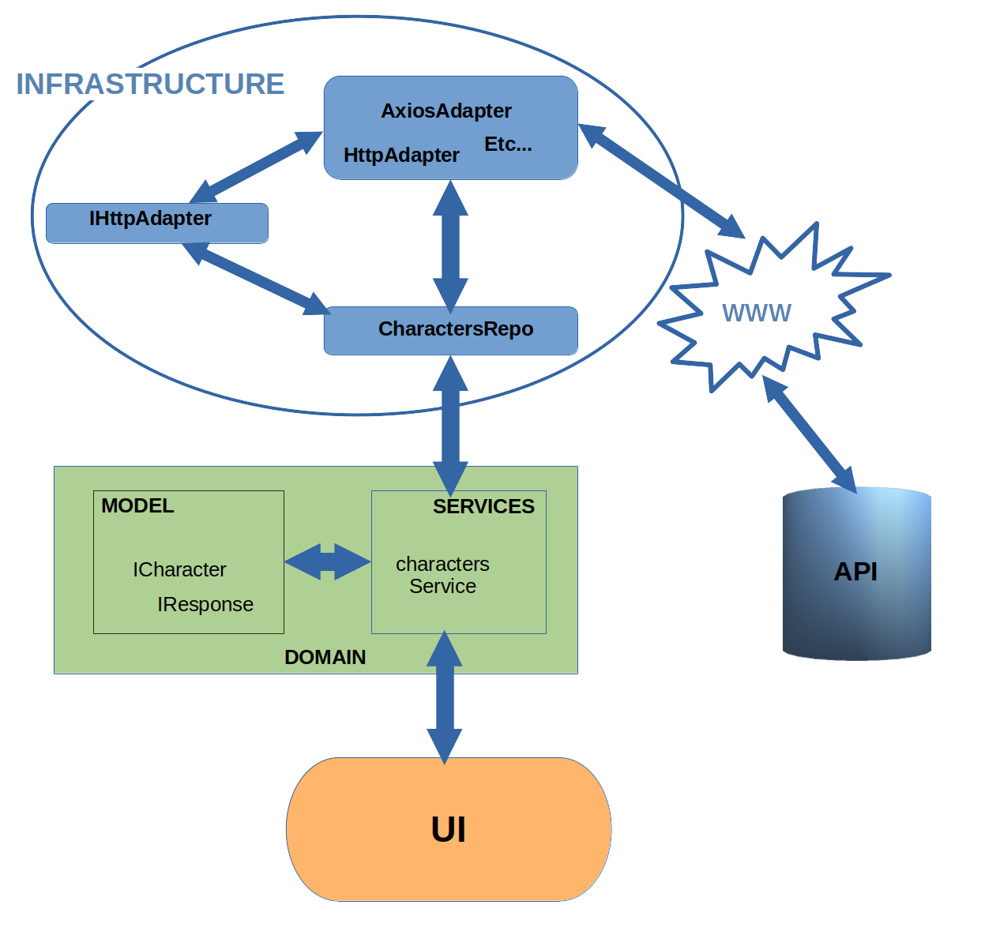

&nbsp;&nbsp;&nbsp;&nbsp;&nbsp;&nbsp;&nbsp;&nbsp;&nbsp;&nbsp;&nbsp;&nbsp;&nbsp;&nbsp;&nbsp;&nbsp;&nbsp;&nbsp;&nbsp;&nbsp;&nbsp;&nbsp;&nbsp;&nbsp;&nbsp;&nbsp;&nbsp;&nbsp;&nbsp;&nbsp;&nbsp;&nbsp;&nbsp;&nbsp;&nbsp;&nbsp;&nbsp;&nbsp;&nbsp;&nbsp;&nbsp;&nbsp;&nbsp;&nbsp;&nbsp;&nbsp;&nbsp;&nbsp;&nbsp;&nbsp;&nbsp;&nbsp;&nbsp;&nbsp;&nbsp;&nbsp;&nbsp;&nbsp;&nbsp;&nbsp;&nbsp;&nbsp;&nbsp;&nbsp;&nbsp;&nbsp;&nbsp;&nbsp;&nbsp;&nbsp;&nbsp;&nbsp;&nbsp;&nbsp;&nbsp;&nbsp;&nbsp;&nbsp;&nbsp;&nbsp;&nbsp;&nbsp;&nbsp;&nbsp;&nbsp;&nbsp;&nbsp;&nbsp;&nbsp;&nbsp;&nbsp;&nbsp;&nbsp;&nbsp;&nbsp;&nbsp;&nbsp;&nbsp;[Back to README](README.md)

# J2dManuelGc

 * Manuel García Criado
 * 46565650B
 * Jump2Digital 2023 Frontend

## Stack

* Framework:&ensp;&ensp;&ensp;&ensp;`Angular 16`
* Layout:&ensp;&ensp;&ensp;&ensp;&ensp;&ensp;&ensp;&ensp;`Bootstrap classes`
* Controls:&ensp;&ensp;&ensp;&ensp;&ensp;&ensp;`Angular Material`
* Infinite scroll:&ensp;&ensp;`ngx-infinite-scroll (directive)`

## Local deploiment (developing)

* You need an internet connection and to have installed [GIT](https://git-scm.com/book/en/v2/Getting-Started-Installing-Git) and [Node.js](https://nodejs.org/en) (with npm) inside your system.
* Create an empty folder for the sources.
* Open a terminal in the created directory.
* Clone the repository with the command line: `git clone https://github.com/manuelgarciacr/j2d-manuel-gc.git .` (Note the dot at the end of the sentence)
* Install the required node packages typing: `npm i`
* Execute the application with the start package JSON script: `npm start`

## Remote deploiment

The application is hosted in GitHub: [https://manuelgarciacr.github.io/j2d-manuel-gc/index](https://manuelgarciacr.github.io/j2d-manuel-gc/index)

## Architecture

I have implemented a design based on Domain Driven Design.

The charactersService obtains the data from the charactersRepo and this from an HttpAdapter.
The IHttpAdapter interface defines the contract for all Http adapters. Subsequently, this same service is responsible for the entire workflow.

This is the workflow:

- The charactersComponent requires a new data page from the charactersService.

- The charactersService gets the data from the charactersRepo.

- The charactersRepo requires the data from an HttpAdapter that implements the IHttpAdapter interface.

- The service gets the data and emits it from the characters$ Observable.

- The headerComponent subscribes to the characters$ Observable, takes the data and sends the filtered characters to the service.

- The service emits the filtered characters from the filteredCharacters$ Observable.

- The charactersComponent subscribes to the filteredCharacters$ observable, gets the data, and displays it to users.

