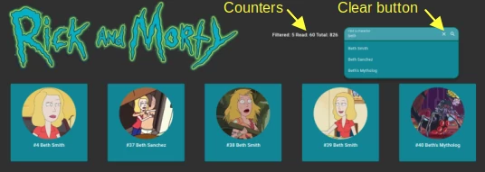
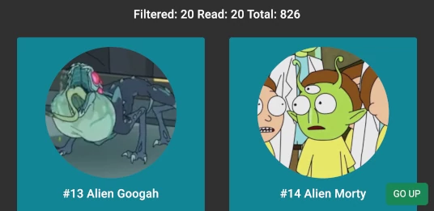
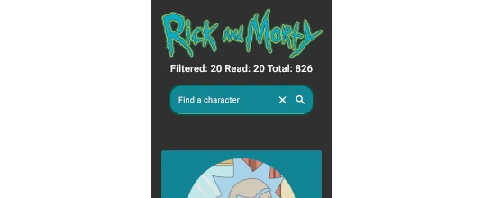
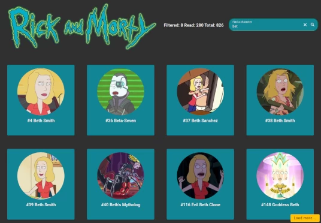
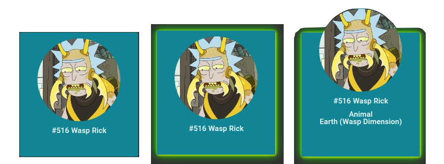

# J2dManuelGc

 * Manuel García Criado
 * 46565650B
 * Jump2Digital 2023 Frontend

## Technical document

[README-TECHNICAL.md](./README-TECHNICAL.md)

## Angular enviroment

[README-ANGULAR.md](./README-ANGULAR.md)

## Application description

### Header

&nbsp;&nbsp;&nbsp;&nbsp;&nbsp;&nbsp;

&nbsp;&nbsp;&nbsp;&nbsp;&nbsp;&nbsp;

&nbsp;&nbsp;&nbsp;&nbsp;&nbsp;&nbsp;
 * It has counters with filtered and downloaded characters and the total number of characters on the server.
 * The selection control has a clear button.
 * Due to the content of the page, landscape orientation on a mobile device doesn't make much sense.
 * Subscribes an Observable from a service that emits the downloaded characters requested by the characters component.
 * Filters downloaded characters and emits them from an Observable within the service.
 * Reactively casts the height of the header to the root component (parent of the header and characters components)

### Characters

&nbsp;&nbsp;&nbsp;&nbsp;&nbsp;&nbsp;

&nbsp;&nbsp;&nbsp;&nbsp;&nbsp;&nbsp;

* Characters are sorted by ID.
* Infinite scroll has been implemented.
* When scrolling, the program tries to fit the cards to the top of the character component.
* A green button at the bottom of the screen, labeled 'GO UP', scrolls to the top of the cards.
* When the app is filtering by name, infinite scroll does not work correctly and a yellow button labeled 'Load more...' is displayed instead of the go up button.
* When downloading data, the button turns red and indicates that it is reading data from the server.

### Cards

&nbsp;&nbsp;&nbsp;&nbsp;&nbsp;&nbsp;

* When you scroll, they try to fit to the top of the component.
* When the pointer is over the card, a green shadow surrounds the card.
* When you click on the card, the image goes up and the character's species and planet are visible.

